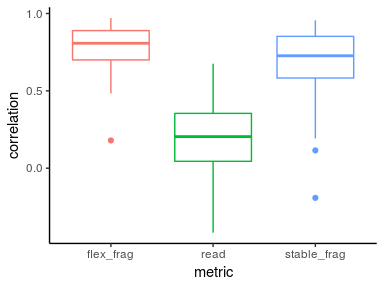
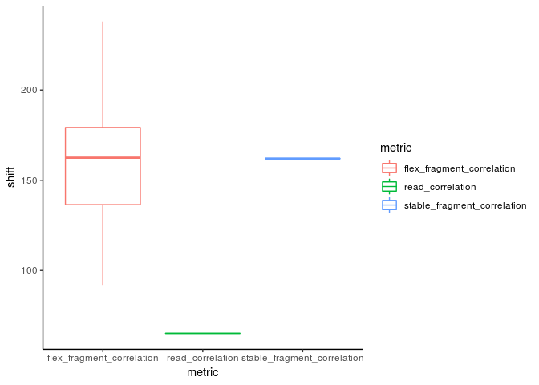
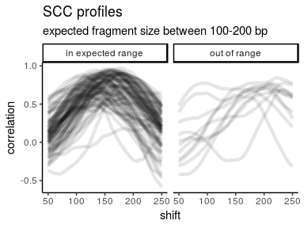

peakrefine
================

Refining peaks using metrics derived from Strand Cross-Correlation (SCC)

This package is under active development but the methods described here
are considered stable.

Eventually peakrefine will be rolled into my existing bioconductor
package,
[seqsetvis](https://bioconductor.org/packages/release/bioc/html/seqsetvis.html),
though still maintained separately here.

## Installation:

``` r
if(!require(devtools))
    install.packages("devtools")
devtools::install_github("jrboyd/peakrefine")
```

## Basic Usage

``` r
bam_file = "path/to/your/bam" #must be indexed
peaks_gr = rtracklayer::import("path/to/your/peaks")
corr_res = peakrefine::calcSCCMetrics(bam_file, peaks_gr, frag_sizes = 50:250)
```

Run this way, 100 peaks will take a bit under a minute.

Results will be automatically cached using BiocFileCache such that
repeated calls with identical parameters load previous results.

## Running in parallel

peakrefine uses the mc.cores option to automatically split up peaks for
calculations. If you run into memory or similar issues you should set
n\_splits to a multiple of mc.cores (this applies to running in serial
as well).  
The default is 1 job per core which may prove too large.

``` r
ncores = max(1, parallel::detectCores() - 1)
options(mc.cores = ncores)
peakrefine::calcSCCMetrics(bam_file, peaks_gr, 
                           frag_sizes = 50:250, n_splits = ncores * 3)
```

## Using the output

Output is a named list:

``` r
cbind(names(corr_res))
```

    ##      [,1]                         
    ## [1,] "read_length"                
    ## [2,] "fragment_length"            
    ## [3,] "read_correlation"           
    ## [4,] "flex_fragment_correlation"  
    ## [5,] "stable_fragment_correlation"
    ## [6,] "full_correlation_results"

Getting read and fragment lengths:

``` r
corr_res$read_length
```

    ## [1] 65

``` r
corr_res$fragment_length
```

    ## [1] 162

Other list items are data.tables:

``` r
sapply(corr_res, class)
```

    ## $read_length
    ## [1] "numeric"
    ## 
    ## $fragment_length
    ## [1] "numeric"
    ## 
    ## $read_correlation
    ## [1] "data.table" "data.frame"
    ## 
    ## $flex_fragment_correlation
    ## [1] "data.table" "data.frame"
    ## 
    ## $stable_fragment_correlation
    ## [1] "data.table" "data.frame"
    ## 
    ## $full_correlation_results
    ## [1] "data.table" "data.frame"

We’ll need a couple more libraries here.

``` r
library(data.table)
library(ggplot2)
```

There are 3 extracted correlation metrics:

  - flex\_fragment\_correlation - the maximum correlation at any shift
  - stable\_fragment\_correlation - the correlation for the average
    fragment size (determined by shift values in flex)
  - read\_correlation - the correlation for the read size (determined by
    mode of bam)

<!-- end list -->

``` r
#items 3-5 of the results list contain these metrics
metrics_dt = rbindlist(corr_res[3:5], use.names = TRUE, idcol = "metric")
metrics_dt[, metric := sub("fragment", "frag", sub("_correlation", "", metric))]
theme_set(theme_classic())
ggplot(metrics_dt, aes(x = metric, y = correlation, color = metric)) + 
    geom_boxplot() + 
    guides(color = "none")
```

<!-- -->

Stable fragment correlation uses the calculated fragment size while flex
always uses the fragment size with the maximum SCC. Flex will report
high correlation from artifact peaks but is useful for assessing
fragment size distribution.

``` r
ggplot(metrics_dt, aes(x = metric, y = shift, color = metric)) + 
    geom_boxplot() + 
    guides(color = "none")
```

<!-- -->

The last item in the list “full\_correlation\_results” stores the
correlation for every value of shift. The previous 3 are simply
extracted from the full results for
conveinence

``` r
to_plot = corr_res$full_correlation_results#[id %in% sample(unique(id), 3)]
to_plot$`Expected_Size` = "in expected range"
out_of_range_ids = unique(corr_res$flex_fragment_correlation[
    shift < 100 | shift > 200]$id)
to_plot[id %in% out_of_range_ids, `Expected_Size` := "out of range"]
ggplot(to_plot, aes(x = shift, y = correlation, group = id)) + 
    geom_path(size = 1.5, alpha = .1) + facet_wrap("Expected_Size") + 
    labs(title = "SCC profiles", 
         subtitle = "expected fragment size between 100-200 bp")
```

<!-- -->
